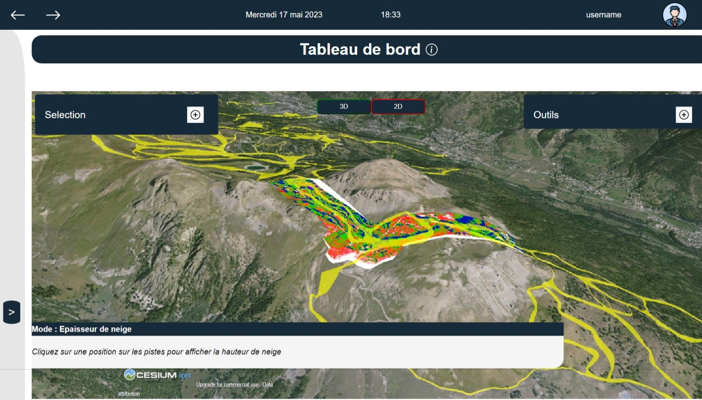
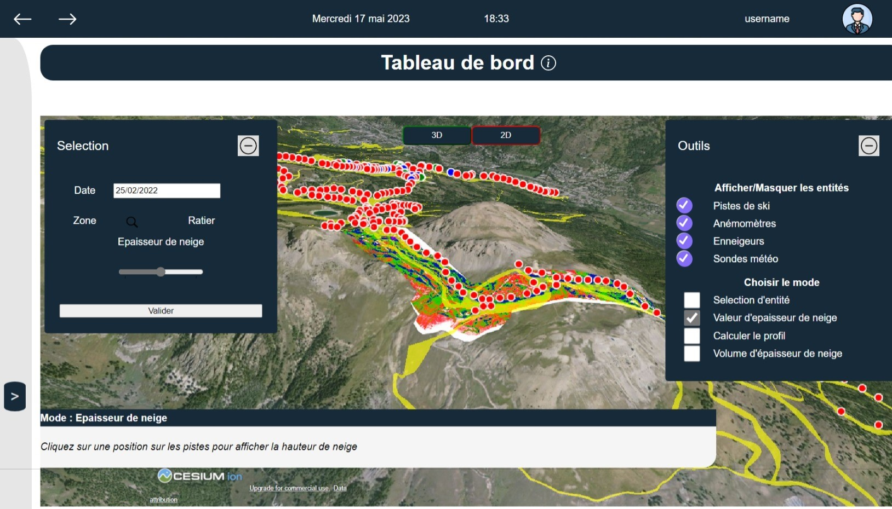
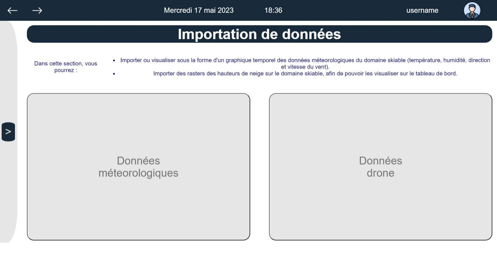
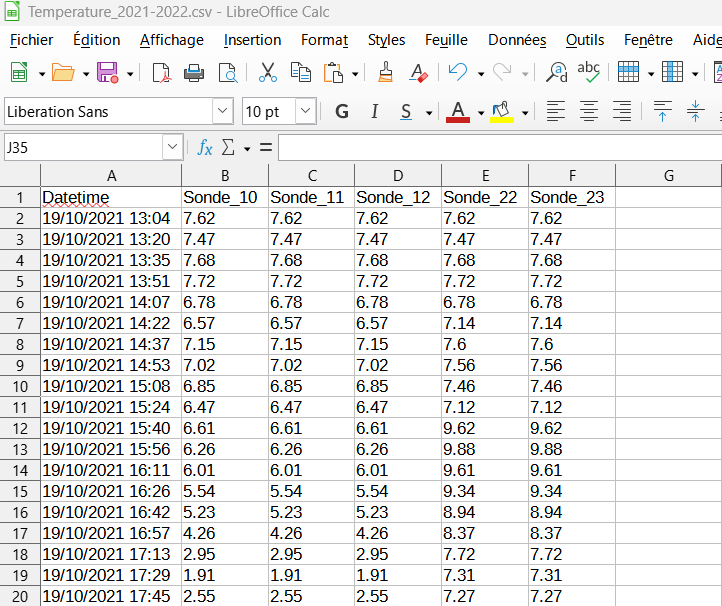
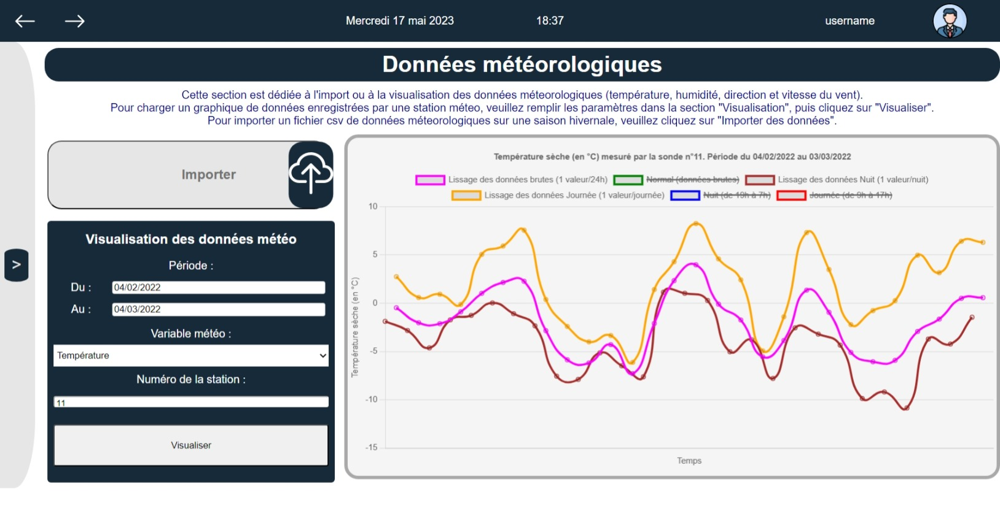
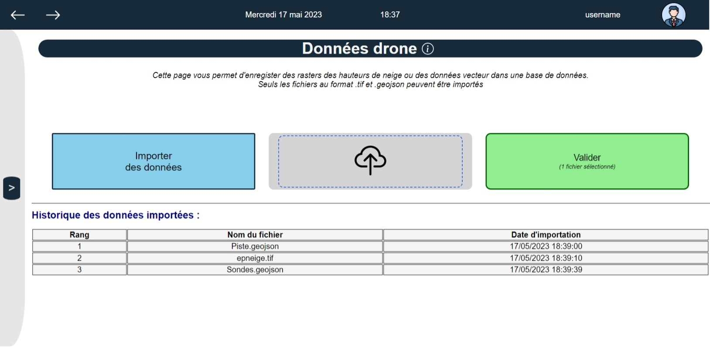
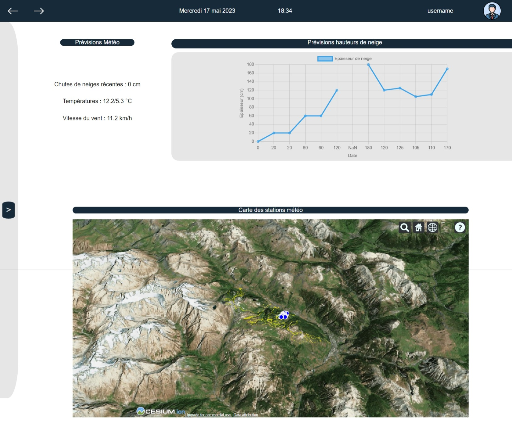
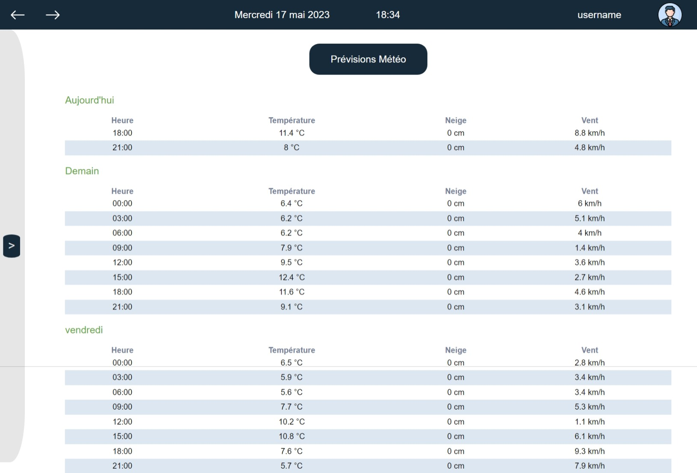
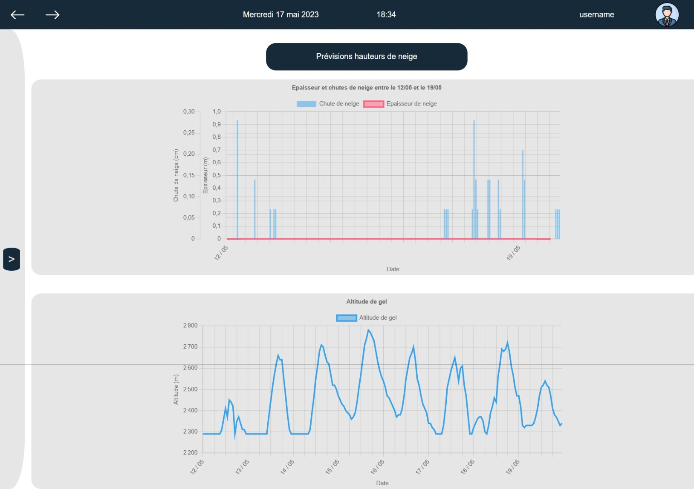
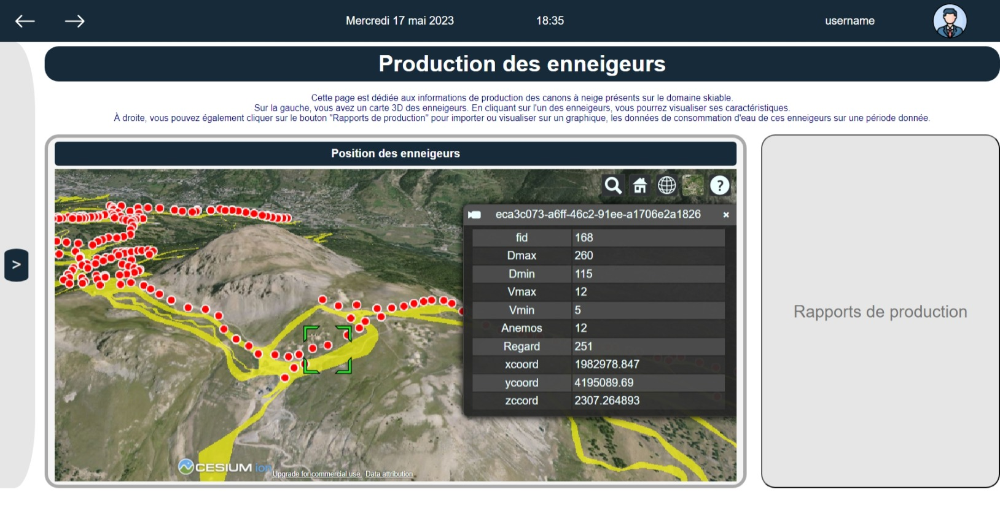

# Guide d'utilisation

## Sommaire

- [1 - Présentation générale](#1---présentation-générale)
- [2 - Connexion et menu](#2---connexion-et-menu)
- [3 - Tableau de bord](#3---tableau-de-bord)
  * [3.A - Visualisation](#3a---visualisation)
  * [3.B - Choix des outils de mesure](#3b---choix-des-outils-de-mesure)
- [4 - Importation des données](#4---importation-des-données)
  * [4.A - Données météorologiques](#4a---données-météorologiques)
  * [4.B - Données drone](#4b---données-drone)
- [5 - Suivi du domaine](#5---suivi-du-domaine)
  * [5.A Prévisions météo](#5a-prévisions-météo)
  * [5.B Prévisions hauteurs de neige](#5b-prévisions-hauteurs-de-neige)
- [6 - Production des enneigeurs](#6---production-des-enneigeurs)
  * [6.A - Rapport de production](#6a---rapport-de-production)
- [Conclusion](#conclusion)
## 1 - Présentation générale

La plateforme web de ELDA TECHNOLOGY vous permet d’importer et de visualiser en toute simplicité les informations et mesures de neige de votre domaine. Vous pouvez étudier l’épaisseur de neige pour mieux planifier le travail des dameuses et optimiser l’utilisation de vos enneigeurs.  

## 2 - Connexion et menu

Entrez votre identifiant et votre mot de passe sur la page de connexion pour accéder à votre profil. Le tableau de bord s’affiche avec une carte Cesium en 3D de votre domaine.

Le menu se trouve à gauche de l’écran. Cliquez sur la flèche à gauche pour déplier le menu. Vous pourrez alors naviguer entre les différentes pages et consulter toutes les informations dont vous avez besoin.

## 3 - Tableau de bord

### 3.A - Visualisation

Le tableau de bord est la première page à s’afficher après la connexion. Il est possible de visualiser les épaisseurs de neige avec une échelle colorimétrique sur une carte Cesium. Cette visualisation est par défaut sur le relief en 3D, mais est également possible sur un plan 2D. Sont également consultables sur la carte le tracé des pistes, la position des enneigeurs et les outils météorologiques du domaine. 

FIGURE - Capture d’écran de la page “Tableau de bord”

Cette page permet donc de visualiser de nombreuses données dans le temps et l’espace du domaine grâce à la carte Cesium et un graphe en bas de page. 
Le passage de la vision 3D/2D se fait à l’aide des boutons 2D/3D en haut de la carte.

En haut de la carte, sont également présents deux menus déroulants : 

FIGURE - Capture d’écran de la page “Tableau de bord” avec les menus déroulants

En haut à gauche, l’onglet Sélection permet de charger un raster des hauteurs de neige sur la carte Cesium.
Après avoir cliqué sur cet onglet, vous devez : 

- choisir la date de visualisation (date des données raster voulues)
- cliquer sur Valider, puis le raster sera affiché sur la carte.

En haut à droite, l’onglet Outils offre la possibilité d’afficher ou de masquer différentes entités sur la carte tels que les pistes, les anémomètres, les enneigeurs ainsi que les sondes météo. Il permet également de sélectionner le mode d’action que l’utilisateur pourra effectuer sur la carte Cesium. Ces modes sont décrits ci-dessous.

### 3.B - Choix des outils de mesure

De nombreuses fonctionnalités implémentées lors de notre projet sont désormais possibles sur la carte Cesium afin de mesurer et d’évaluer en toute simplicité le manteau neigeux sur le domaine skiable.  
Les différents outils se trouvent en bas de l’onglet Outils ().  
Par défaut, l’utilisateur est en mode valeur d’épaisseur de neige. 

Voici la description des modes disponibles : 

-Le mode **Sélection d’entité** permet de sélectionner par un clic un objet de la carte (piste, enneigeur, anémomètre, sonde) pour afficher ses caractéristiques.

-Le mode **Valeur d’épaisseur de neige** permet de mesurer en un point de la carte l’épaisseur de neige. Pour cela, il suffit de cliquer sur la zone du raster que l’on souhaite mesurer, la valeur en mètres s’affiche dans la fenêtre en bas de la carte.

-Le mode **Calculer le profil** permet d’afficher le profil de hauteur de neige sur un segment à tracer sur la carte.  
Il suffit de cliquer en deux points sur la carte, un segment s’affiche alors sur le relief. Il est possible de modifier le tracé pour le corriger si besoin.  
Après validation dans la fenêtre en bas de la carte, le profil de hauteur de neige s’affiche dans un graphe en dessous de la carte.

-Le mode **Volume d’épaisseur de neige** permet de mesurer le volume total de neige dans une aire à définir. Il suffit de cliquer sur la carte pour dessiner un polygone définissant le contour de l’aire à mesurer. 
Il est possible de modifier le tracé du polygone pour le corriger si besoin.  
Après validation dans la fenêtre en bas de la carte, le volume de neige volume en m³ s’affiche dans cette même fenêtre.  

## 4 - Importation des données

Cette section permet à l’utilisateur d’importer ses données ainsi que de visualiser quelques graphiques.

FIGURE - Capture d’écran de la page “Importation de données”

La page d’accueil de cette section se décompose en deux parties :  

- Le bouton Données météorologiques vous permettra l’importation et la visualisation de données météorologiques (température, humidité, vitesse et direction du vent) sur un graphique.
- Le bouton Données drone vous permettra l’importation des données qui seront affichées sur le tableau de bord : raster des épaisseurs de neige au format .tif, ou les fichiers de la position des pistes et des points d’intérêt du domaine skiable au format .geojson .

### 4.A - Données météorologiques

Vous souhaitez visualiser l’évolution des données météorologiques mesurée par une des sondes météo sur une période donnée.

Par exemple, vous souhaitez visualiser les variations de température mesurées par la station n°11 entre le 24/01/2022 et le 25/03/2022.

Pour cela, si ce n’est pas déjà fait, il faut dans un premier temps importer le fichier .csv des températures sur la saison hivernale 2021-2022 dans la base de données.
Si c’est déjà fait, passez directement à l’étape 2.

ETAPE 1 : IMPORTATION DU FICHIER

Avant de vouloir importer votre fichier .csv, assurez-vous d’avoir bien respecter les règles de format suivants : 

- Règle n°1 : votre fichier doit se nommer de la manière suivante 
“NomVariableMeteo_PremièreAnnéeSaisonHivernale-DeuxièmeAnnéeSaisonHivernale”.
Dans notre exemple, le fichier doit se nommer : Temperature_2021-2022.csv  
Autres exemples : Humidite_2017-2018.csv, DirectionVent_2019-2020.csv, VitesseVent_2019-2020.csv
- Règle n°2 : Le contenu de votre fichier .csv doit être de la forme suivante

FIGURE : Capture d’écran d’un modèle de fichier .csv de données météorologiques

La première colonne nommée “Datetime” regroupe les dates au format “DD/MM/YYYY”.  
Les autres colonnes nommées “Sondes_XX” regroupent les valeurs météorologiques enregistrées pour chacune des sondes météo XX.

Si ces deux conditions sont respectées, vous pouvez procéder à l’import.  
Cliquez sur le bouton Importer des données à gauche de la page, votre explorateur de fichiers va s’ouvrir.  
Assurez-vous de placer votre fichier dans le dossier d’importation prévu à cet effet : il s’agit du dossier “data_import”, lui-même présent dans le dossier “BDD”.  
Enfin, validez le fichier dans votre explorateur.   

Un popup s’affichera pour vous informer que votre fichier est maintenant stocké dans la base de données !

ETAPE 2 : VISUALISATION DES DONNÉES

Ces données sont donc visualisables sous la forme d’un graphique, à droite de la page.
Pour cela, remplissez le formulaire présent à gauche de la page : 

- Sélectionnez la date de début et de fin de la période souhaitée.
- Choisissez une variable météo
- Entrez le numéro de la station
- Cliquez sur ‘Visualiser’,  et le graphique s’affichera sur la section de droite.

Remarque : Dans le cas de données indisponibles sur la période ou sur la station météo renseignée, un pop-up vous en informera juste après votre validation du formulaire.

FIGURE - Capture d’écran de la page web “Données météorologiques” avec la requête de visualisation de la température mesurée par la sonde n°11 entre le 04/02/2022 et le 03/03/2022 

### 4.B - Données drone

Vous souhaitez importer des données raster des hauteurs de neige (format .tif), ou bien des données d’infrastructures du domaine skiable (format .geojson) .

IMPORTANT : Seuls les formats .tif et .geojson sont acceptés.
Assurez-vous de placer votre fichier dans le dossier d’importation prévu à cet effet : il s’agit du dossier “data_import”, lui-même présent dans le dossier “BDD”.

Pour cela vous disposez de 2 choix : 
Cliquez sur le bouton Importer des données à gauche, et validez le fichier dans votre explorateur de fichiers
Glissez le fichier dans la dropzone au milieu
Une fois que vous avez chargé chacun de vos fichiers via une de ces 2 méthodes, cliquez sur le bouton Valider à droite.

Pour chaque fichier importé sur la base de données, vous recevrez un popup de confirmation. L’historique des fichiers venant d'être importés sera affiché en bas de page.

FIGURE - Capture d’écran de la page web “Données drone” lorsque l’utilisateur est sur le point d’importer son 4ème fichier

## 5 - Suivi du domaine

Le suivi du domaine permet de consulter les prédictions météo et les prédictions de hauteurs de neige. Il est aussi possible de consulter la position et les caractéristiques du matériel météorologique sur la carte du domaine. Pour obtenir plus d'informations, il suffit de cliquer sur la rubrique que l’on souhaite consulter.

FIGURE - Capture d’écran de la page web “Suivi du Domaine"

Stations météo

La carte du domaine permet de visualiser l’emplacement ainsi que de consulter les caractéristiques des stations météo du domaine.

### 5.A Prévisions météo

Cette page permet de consulter la météo du domaine sur les 3 prochains jours. Les différents paramètres consultables sont : la température, les chutes de neiges et le vent.
	

FIGURE - Capture d’écran de la page web “Prévisions Météo"

### 5.B Prévisions hauteurs de neige

FIGURE - Capture d’écran de la page web “Prévisions des hauteurs de neige"

Cette page donne la hauteur de neige sur les 5 derniers jours ainsi qu’une prédiction sur les 3 prochains jours. Il est aussi possible de consulter l’altitude de gel du domaine.

## 6 - Production des enneigeurs

La section Production permet de consulter les données de position, de production et de consommation des enneigeurs. 

FIGURE - Capture d’écran de la page web “Production des enneigeurs” lorsque l’utilisateur vient de cliquer sur un enneigeur sur la carte Cesium

A gauche, la partie Position des enneigeurs, une carte Cesium permet de visualiser en 2D ou en 3D l’emplacement des enneigeurs. Les caractéristiques de chaque enneigeur sont disponibles en cliquant directement dessus.

A droite, le bouton Rapports de production vous redirige vers la page décrite ci-dessous.

### 6.A - Rapport de production 

Cette section sert à visualiser sur un graphique l’évolution de la consommation en eau par un enneigeur sur une période donnée.
**Ces données ne sont pas visualisables car elles sont confidentielles**

Paramètres (non développé)

Cette page non développée est accessible en cliquant sur l'icône engrenage du menu. Elle permettra de consulter les données liées au compte.
