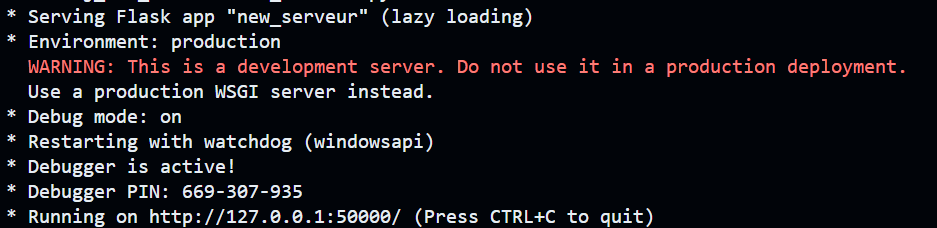

# Interface graphique SIG pour la plateforme web ELDA TECHNOLOGY destinée aux stations de ski

## Objectif du projet

L'objectif de ce projet est de réaliser une interface web pour [ELDA TECHNOLOGY](http://eldatechnology.fr/) dans le but de concevoir une interface web permettant la visualisation de statistiques sur un domaine skiable ainsi qu'une visualisation 2D et 3D de la hauteur de neige sur les pistes du domaine.
ELDA TECHNOLOGY utilise les techniques de l'acquisition LiDAR par drone pour mesurer les hauteurs de neige sur le domaine skiable, en comparant l’élévation du terrain avec un MNT de base.

Ce projet contribuera au développement de l'entreprise ELDA TECHNOLOGY car elle acquerra l’expertise suffisante pour éviter aux gérants des domaines skiables la sur-production de neige de culture. C’est un projet qui apporte donc une solution économique (moins de dépenses pour la production de neige) et écologique (moins de consommations énergivores).

## Comment déployer le projet en local ?

### Récupérer le projet en local

#### Avec git :

Commande git dans le répertoire de votre choix: 

```bash
git clone https://github.com/beubeuENSG/Proj_Dev_Ski.git
```

#### En téléchargeant directement :

Sur la page GitHub du projet cliquez sur le bouton "Code", puis sur "Download ZIP" et dézippez le dossier du projet en local.

### Setup de Apache

Ce site web à été implémenté en utilisant un serveur Apache.
Si vous utilisez MAMP ou WAMP pour lancer Apache, vous devrez lier votre logiciel (configurant votre environnement de développement local) sur le dossier que constitue le git dans votre explorateur de fichiers.

### Mise en place de la base de données sur PostgreSQL

Vous trouvez le fichier en ".sql" dans le dossier "BDD" sous le nom de "bdd_ELDA.sql".
Ce fichier contient l'ensemble du code SQL nécessaire à la construction de la base de données nommée "PDI_ELDA_new".


#### Avec une commande psql : 

```bash
psql -U [nom_utilisateur] -d [nom_base_de_donnees] -f [chemin_fichier_sql]
```

#### Manuellement :

- Lancez pgAdmin et connectez-vous à votre serveur PostgreSQL.
- Dans l'arborescence du serveur, installez le fichier .sql dans une base de données nommée "PDI_ELDA_new".
- Cliquez avec le bouton droit de la souris sur la base de données et sélectionnez "Query Tool" dans le menu contextuel.
- Dans la fenêtre "Query Tool", cliquez sur le bouton "File Open" (ou appuyez sur Ctrl+O) pour ouvrir le fichier .sql que vous souhaitez installer.
- Copiez et collez le contenu du fichier .sql dans la fenêtre "Query Tool".
- Cliquez sur le bouton "Execute" (ou appuyez sur F5) pour exécuter le script SQL et installer les tables, les vues ou les procédures stockées dans la base de données.

### Serveur Python

Lancez le serveur Python situé dans le dossier BDD sous le nom de **'new_serveur.py'**.

Le serveur sera lancé lorsque vous verrez le message suivant dans le terminal : 



Note : le serveur se lance initialement sur le port 50000 vous pouvez le modifier librement dans le main du fichier. Si vous le faites, modifiez les fichiers JavaScript associés en fonction.

## Guide d'utilisateur

Il est également conseillé de lire la documentation utilisateur du site Web.
Ce fichier nommé 'GUIDE.md' vous donne tous les outils et les instructions nécéssaires pour une navigation simple et sans problèmes.
